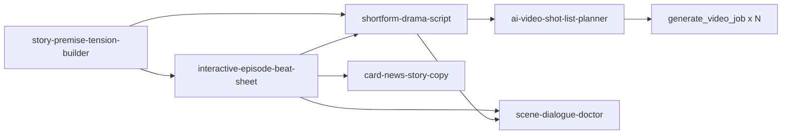

# 스크린라이팅 기반 콘텐츠 템플릿 6종 — 등록 핸드오프

| 항목 | 값 |
| --- | --- |
| 작성 | 2026-10-02 |
| 상태 | **문서·payload 준비 완료 / 운영 등록 전 (`blocked: concept-scan-pending`)** |
| 템플릿 원본 | `.agent/content/ai-prompts/content_templates/new/*.md` (6개) |
| 등록 payload | `payloads/*.payload.json` (`upsert_content_prompt_template` 인자 그대로) |
| 재검증 | `bash tools/run.sh` — node-app의 실제 `validatePromptTemplateFields` / `renderContentPrompt`로 검사하고 payload를 다시 만든다 |
| 원장 행 초안 | `ledger-rows.pending.jsonl` (등록 성공 후 `id`·`date`를 채워 `.agent/content/content-ledger.jsonl`에 append) |
| 설계 근거 | `.agent/references/AMU_APP/screenwriting-skills-application-plan.md` §4·§9 |

등록 규칙의 근거는 다음 문서들이다.
- `content_prompt_template_creation.md`(작성 규칙)
- `genstudio-prompt-registration-guide.md`(마크다운 → payload 매핑, 호출 순서)
- `amu-custom-mcp/SKILL.md`(MCP 규칙)
- `node-app/rules/amu-ai.md`, `gen-studio-process.md`(문법·운영 SSOT)

---

## 1. 템플릿 목록과 파이프라인 연결

| # | key | 제목 | 산출물 | platform / outputFormat | 필수 변수 | 연결되는 AMU 프로세스 |
| --- | --- | --- | --- | --- | --- | --- |
| 1 | `story-premise-tension-builder` | 지식 소재를 이야기 전제로 바꾸는 기획 설계 | 기획서 | general / markdown/mermaid | 소재, 관점구성 | 모든 서사형 콘텐츠의 첫 단계 (SSOT S03–S05) |
| 2 | `interactive-episode-beat-sheet` | 인터랙티브 아티클·캐릭터 에피소드 비트 시트 설계 | 설계서 + Mermaid 흐름도 | blog / markdown/mermaid | 지식주제, 핵심질문, 콘텐츠형식 | 인터랙티브 아티클 Tier 1·2 (SSOT S07–S14) |
| 3 | `shortform-drama-script` | 세로형 숏폼 숏드라마 대본 생성 | 초 단위 타임라인 대본 | youtube / markdown/mermaid | 원천자료, 핵심질문, 영상길이 | 숏폼(Teaser / Short-form Drama), editorial-story `surfaces.short` |
| 4 | `ai-video-shot-list-planner` | AI 영상 생성용 숏 리스트 설계 | 숏 리스트 JSON | general / json | 장면설명, 클립규격 | Gen Studio 영상 생성 (`generate_video_job` 입력 준비) |
| 5 | `card-news-story-copy` | 이야기 구조 카드뉴스 카피 생성 | semantic 카드 JSON | instagram / json | 원천자료, 카드수 | 카드뉴스 에이전트 `semanticContent.cards` 초안 |
| 6 | `scene-dialogue-doctor` | 장면·대사 진단과 리라이트 | 진단표 + 수정본 | general / markdown/mermaid | 원고, 수정강도 | 2·3번 결과물의 검수 단계 (SSOT S18 Editorial 보조) |

**권장 흐름**



- 3 → 4: 숏폼 대본 결과를 숏 리스트 템플릿의 `장면설명`에 그대로 붙여 넣는다.
- 4 → 영상: 숏 리스트 JSON의 숏마다 `generate_video_job`을 호출한다.
  - `durationSec`는 `VIDEO_CAPABILITY_MATRIX` 값만 쓰도록 템플릿에서 제한했다. `4·6·8초 클립`은 google, `5·10초 클립`은 xai/zai에 해당한다.
  - 비용·외부 호출 고지 규칙(`amu-custom-mcp`)을 따른다.
- 5: 출력 JSON의 `cards[]` 필드(`role / eyebrow / headline / body / cta / altText`)는 `types/card-news/agent.ts`의 `parseCard` 허용 필드와 같다. 다만 `visualHint`·`sourceNote`·`storyPlan`·`hashtags`·`checks`는 에이전트 payload에 넘기기 전에 제거해야 한다(`assertKeys`가 거부한다). `template { id, version }`은 덱 생성 시 별도로 채운다.

---

## 2. 검증 결과 (2026-10-02, `tools/run.sh`)

```text
PASS ai-video-shot-list-planner     | vars=8 (required 장면설명,클립규격)               | selects=6 | conditions=11 | option renders=18
PASS card-news-story-copy           | vars=7 (required 원천자료,카드수)                 | selects=5 | conditions=15 | option renders=18
PASS interactive-episode-beat-sheet | vars=8 (required 지식주제,핵심질문,콘텐츠형식)    | selects=4 | conditions=16 | option renders=14
PASS scene-dialogue-doctor          | vars=6 (required 원고,수정강도)                   | selects=3 | conditions=9  | option renders=10
PASS shortform-drama-script         | vars=9 (required 원천자료,핵심질문,영상길이)      | selects=6 | conditions=20 | option renders=22
PASS story-premise-tension-builder  | vars=5 (required 소재,관점구성)                   | selects=3 | conditions=8  | option renders=9
```

`tools/run.sh`가 검사하는 항목은 다음과 같다.

- **문법**: 서버 validator(`validatePromptTemplateFields`) issue 0건.
- **조건문**: `{#if field == "value"}` 단일 형식만 사용한다. `!=`, else, 중첩, 복합 조건이 없다. 모든 조건값이 실제 옵션과 일치한다(오타로 영원히 실행되지 않는 블록이 없다).
- **렌더링**: Select 옵션마다 한 번씩 실제 `renderContentPrompt`로 렌더링해 필수 변수 누락과 잔존 토큰(`{#if`, `::`)이 0건인지 확인한다.
- **필수 변수·옵션**: 필수 자유 입력이 최소 1개 있다. Select는 옵션 2~8개다. 옵션 라벨은 `normalizeLabel()`이 변형하지 않는 한글 단문이고, 확장 토큰(`;`)은 쓰지 않았다.
- **메타데이터**: key는 kebab-case이고 파일명과 같다. 대표카테고리 2~4개, 키워드는 한·영 각 10개 이하이고 1~2단어다. 활용팁 140자 이하, `defaultParams` 4개 키, `outputFormat ∈ {markdown/mermaid, json}`, 템플릿에 역할·구조·톤·품질기준 섹션이 있다.

**설계상 결정 두 가지**
1. **구조를 바꾸는 Select는 필수(`*`)로 지정했다.** 영상길이, 클립규격, 카드수, 콘텐츠형식, 관점구성, 수정강도가 여기에 해당한다. 렌더러는 미입력 Select 토큰을 첫 옵션으로 치환하지만, `{#if}` 조건은 빈 값으로 평가한다. 그래서 MCP `generate_content`처럼 변수를 생략해 호출하면 "영상 길이: 30초"라고 적혀 있는데 30초 구조 블록은 빠지는 불일치가 생긴다. 이것을 막기 위해서다.
2. **확장 옵션 토큰(`라벨; 설명; 프롬프트`)은 쓰지 않았다.** 긴 지시문은 모두 조건 블록에 두었다. 현재 저장소의 `renderContentPrompt`는 비필수 Select 값에 `normalizeLabel()`만 적용하므로, 확장 토큰의 프롬프트 분절 처리 경로를 이 저장소에서 확인할 수 없었다.

---

## 3. 등록 전 필수 — 착수 게이트(개념 중복 검사) 미실행

이 세션에는 `genstudio` MCP가 연결되어 있지 않아 `list_prompts` / `get_prompt_template` 조회를 하지 못했다. 규칙상 **조회 실패 시 추정으로 판정하지 않고 등록을 중단(fail-closed)** 하므로, 6개 모두 `blocked: concept-scan-pending` 상태다. 등록하는 세션에서 아래 순서를 먼저 실행한다.

| key | `q` 개념어 (한/영) | `category` 조회 | 중복 위험 | 중복이 확인되면 |
| --- | --- | --- | --- | --- |
| `story-premise-tension-builder` | 기획, 스토리, 로그라인, 아이디어 / premise, logline, storytelling, ideation | 스토리텔링, 콘텐츠 기획, 아이디어 발상 | 중간 — 사고 공식형 아이디어 템플릿과 ①②축이 겹칠 수 있다 | 기존 사고 공식형 템플릿에 `{사고법::…\|스토리 전제}` 옵션과 조건 블록으로 흡수 |
| `interactive-episode-beat-sheet` | 인터랙티브, 비트, 기획서, 에피소드 / interactive, beat sheet, episode | 인터랙티브 콘텐츠, 매거진 기획 | 낮음 | — |
| `shortform-drama-script` | 숏폼, 대본, 쇼츠, 릴스 / shortform, script, shorts, reels | 숏폼 영상, 영상 대본 | **높음** — 숏폼·릴스 대본 템플릿이 이미 있을 가능성 | 4축 판정. 3축 이상이면 기존 key에 `장르`·`결말방식` 조건 블록을 가산 병합(`strictNew=false`, `version+1`) |
| `ai-video-shot-list-planner` | 숏 리스트, 콘티, 영상 프롬프트 / shot list, storyboard, video prompt | 영상 생성, 영상 기획 | 중간 | 기존 영상 프롬프트 템플릿과 ④축(json 숏 배열)이 다르면 신규 |
| `card-news-story-copy` | 카드뉴스, 캐러셀, 카피 / card news, carousel, copywriting | 카드뉴스, 소셜미디어 콘텐츠 | **높음** — 카드뉴스 카피 템플릿이 이미 있을 가능성 | 기존 카드뉴스 템플릿에 `구성방식::요약형\|기승전결형` 옵션 + 조건 블록으로 흡수가 1순위 |
| `scene-dialogue-doctor` | 대사, 편집, 첨삭, 리라이트 / dialogue, rewrite, editing | 글쓰기 편집 | 중간 — 편집자형(글 다듬기) 템플릿과 ②축이 겹칠 수 있다 | 대본·장면 진단은 ①④축이 달라 신규 가능성이 높다. 판정 근거를 기록 |

```text
list_prompts({ promptType: "content", q: <개념어>, limit: 100 })        # 위 개념어마다
list_prompts({ promptType: "content", category: <카테고리>, limit: 100 })  # 위 카테고리마다
get_prompt_template({ templateKey: <상위 후보 3~5>, promptType: "content" })
```

판정 결과(후보 목록, 4축 일치 수, 신규 / 흡수 / 갱신 결정과 근거)는 이 README §5에 기록한다.

---

## 4. 등록 절차 (게이트 통과 후)

1. **신규 판정만** `payloads/<key>.payload.json`을 그대로 `upsert_content_prompt_template`에 전달한다. 1차 호출은 `strictNew: true`다(payload에 이미 들어 있다).
   - `usageTip`은 콘텐츠 스키마에 매핑되지 않을 수 있다. 라우트가 거절하면 해당 필드만 빼고 다시 보낸다.
2. 결과를 다음처럼 처리한다.
   - `CONFLICT`: key를 바꿔 우회하지 않는다. 같은 개념이면 갱신 경로로 가고, 아니면 skip하고 보고한다.
   - `INVALID_INPUT`: `issues[]` 기준으로 원본 md를 고친 뒤 `tools/run.sh`로 payload를 다시 만든다.
3. `get_prompt_template({ templateKey, promptType: "content" })`로 재조회해 다음을 대조한다(`text-encoding-integrity` 규칙).
   - `title`
   - 한글 본문
   - `defaultParams`(특히 `outputFormat`)
   - 필수 변수 표시
4. 관리자 UI `ContentPromptStructuredFields`에서 `platform / language / length / outputFormat`이 정상 매칭되는지 확인한다.
   - `general`은 UI 프리셋 목록에 없어 "기타(직접 입력)"로 표시되는 것이 정상이다.
5. 원본 md를 `content_templates/new/` → `content_templates/completed/`로 옮긴다.
6. `ledger-rows.pending.jsonl`의 해당 행에 `id`·`date`를 채워 `.agent/content/content-ledger.jsonl`에 append한다.
   - `funnel`(초안값 `P1`)과 `campaignId`는 `MARKETING-STRATEGY.md` 기준으로 확정한다.
7. (선택) 템플릿별 샘플 1건을 `generate_content`로 생성한다.
   - 비용·provider·model·최대 출력 토큰을 먼저 고지한다.
   - 본문은 `get_content_asset`으로 받는다.
   - 샘플은 아래 입력으로 만든다.
     - 1번: "복리"
     - 3번: 1번 결과의 핵심 질문 + 30초 + 본편 기사로 연결
     - 4번: 3번 결과 + `4·6·8초 클립`
   - 이렇게 연쇄 샘플을 만들면 흐름 전체를 한 번에 검수할 수 있다.

---

## 5. 판정 기록 (등록 세션에서 작성)

| key | 조회 후보 | 일치 축 | 판정 | 근거 | 처리 결과 |
| --- | --- | --- | --- | --- | --- |
| `story-premise-tension-builder` | | | | | |
| `interactive-episode-beat-sheet` | | | | | |
| `shortform-drama-script` | | | | | |
| `ai-video-shot-list-planner` | | | | | |
| `card-news-story-copy` | | | | | |
| `scene-dialogue-doctor` | | | | | |

---

## 6. 알려진 차이와 주의

- **platform 값 목록이 문서와 UI에서 다르다.**
  - 규칙 문서: `naver-blog|linkedin|threads|wp-blog|general`
  - node-app UI 프리셋(`CONTENT_PLATFORM_OPTIONS`): `instagram|threads|linkedin|x|youtube|blog`(+ 기타)
  - 이번에는 채널 의미가 정확한 UI 프리셋(`youtube`·`instagram`·`blog`)과 규칙 문서의 `general`을 썼다. 정본 목록을 어느 쪽으로 맞출지 별도 결정이 필요하다.
- **JSON 출력은 지시일 뿐 서버가 강제하지 않는다.** `outputFormat: json`인 4·5번은 템플릿 문장으로만 JSON을 요구한다. 파이프라인에서 쓰려면 소비 측에서 스키마를 검증해야 한다(설계 문서 §9.3 보강 2).
- **조건 블록이 비활성일 때 빈 줄이 남는다.** 렌더러가 빈 줄을 정리하지 않아 최종 프롬프트에 연속 빈 줄이 남지만, 생성 품질에는 영향이 없다.
- **저작권**: 템플릿 본문은 스킬의 원칙·체크리스트만 한국어로 새로 쓴 것이다. 원저·번역서·각본의 인용문은 포함하지 않았다(screenwriting-skills NOTICE: 인용문은 MIT 대상이 아님). 공개 기사(콘텐츠 프롬프트 가이드 기사)에서 원리를 해설할 때도 원저 문장을 인용하지 않는다.
- **마케팅 운영 에이전트는 이 템플릿을 새로 만들거나 수정하지 않는다**(`marketing-ops-agent` 제한). 등록 후 `templateKey` 참조만 가능하다.
